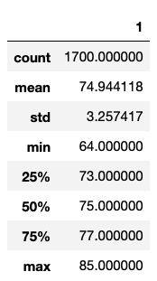
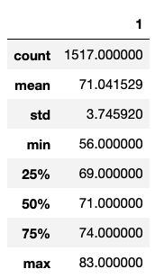

# surfs_up
# Surfs Up Weather Analysis

## Overview
An Entrepreneurial colleague was considering opening up a surf shop in Hawaii that would double as an ice cream store, serving cold treats to those shopping for beach goods. The entrepreneur’s hypothesis was that offering ice cream would give him a competitive advantage over other surf shops that simply offered typical surf and beach paraphernalia. Before approaching investors or committing to the project he wanted to get more information about the weather in the area to better inform the predictability of the ice cream strategy. He believed that consistently warmer weather would be ideal to attract surfing ice cream eaters. Specifically, he wanted temperature data for the months of June and December in Oahu, in order to determine if the surf and ice cream shop business would be sustainable year-round.

### Resources
Python3
SQLAlchemy ORM
SQLite database

## Overview of the Analysis: 
To complete this analysis, several steps were conducted. First, a table from a SQLite database was filtered on values from a column. Next, the query results were saved as a Pandas DataFrame. Then summary statistics were called. Finally, histograms were created to visualize a comparison of the temperature frequencies for June and December. 

## Results: 
The following results were derived from the statistical analysis. Figure 1 and Figure 2 display the descriptive statistics for temperature readings in the months of June and December. As can be seen, the mean temperatures for June (75) and December (71) are very similar. The maximum temperatures for June (85) and for December (83) are also similar. However, the minimum temperatures for June (64) December (56) have slightly more variation. The histograms in Figure 3 and Figure 4 provide a visual representation of the frequency and distribution of temperature ratings. For June, it appears that temperatures in the mid to upper 70s were recorded closer to 200 times where in December temperatures that same range were recorded less frequently. 

Figure 1. June Statistical Summary

Figure 2. December Statistical Summary

Figure 3. June Temperatures                              Figure 4. December Temperatures
               

## Summary: 
In summary the temperature readings for Hawaii appeared to be quite similar in both June and December, at least in the year this data was recorded. While there was some reduction in mean temperature from June to December it seems trivial. A lower minimum temperature was also observed but this would be expected to some extent. Compared with other regions of the world this difference in minimum temperatures in Dealso seems somewhat trivial. However, a comparison with other coastal areas where surfing is popular would be warranted. Some additional queries would also be beneficial. This analysis was limited to comparisons of only two months in one year. A more longitudinal analysis of temperature trends across that year or across multiple years would help understand longer timeframe trends. This study also only considered temperature as a potential predictor of ice cream traffic.  Perhaps other weather data should be considered as well, such as humidity, wind, or number of daylight hours. Lastly, this study also was limited to weather, perhaps analyses should be done on other factors such as foot traffic in the area, hotel occupancy rates, or other factors that could help understand the potential volume of ice cream loving surfers looking for novel retail experiences. 
